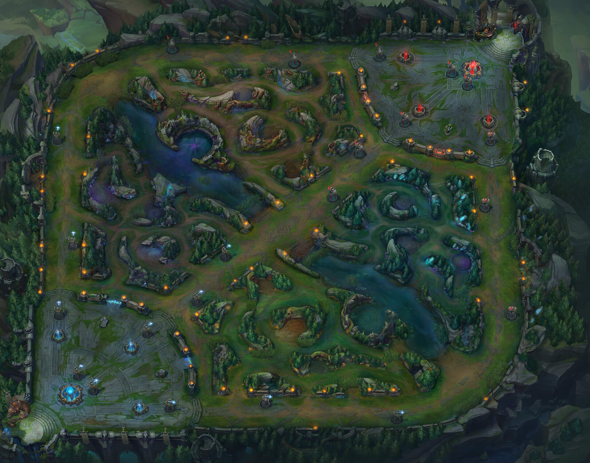
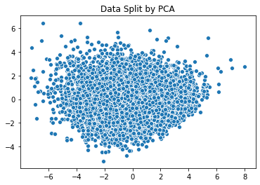
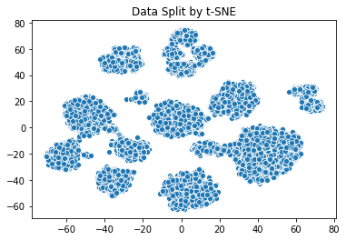
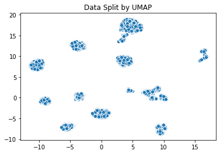
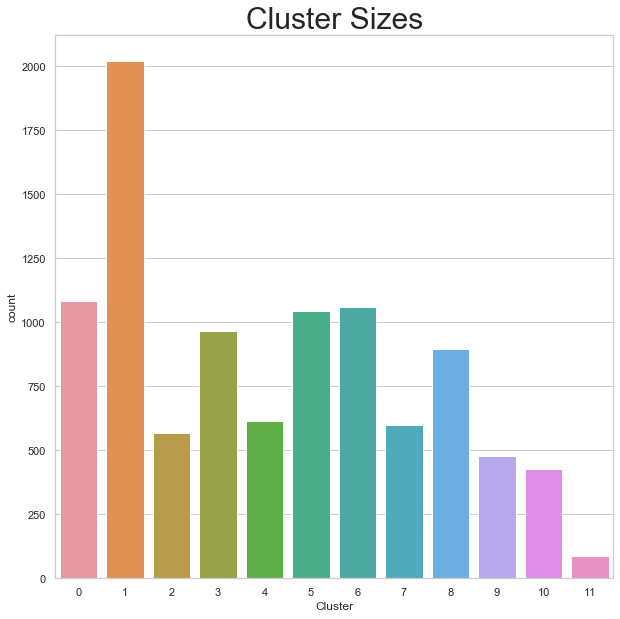
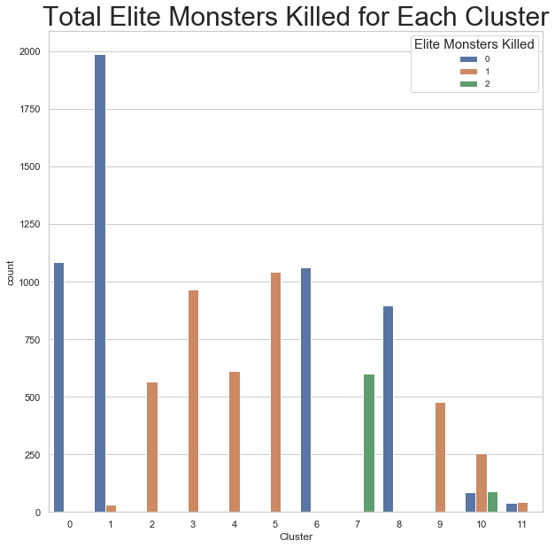
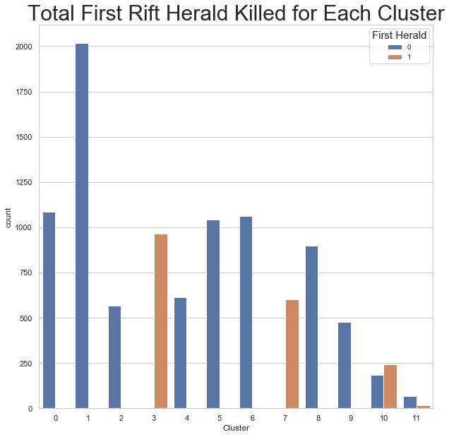
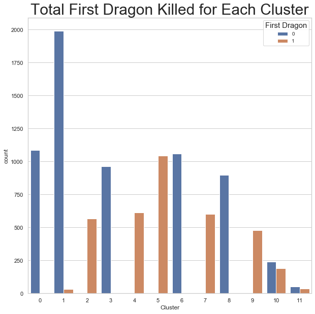
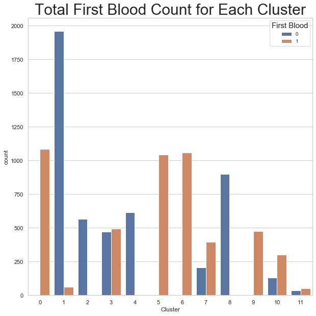
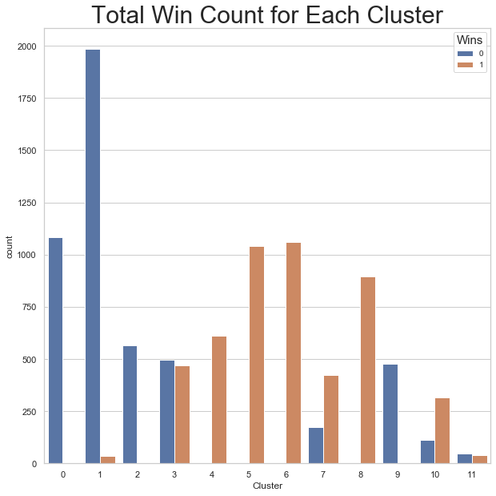

# Having Fun with a League of Legends Data Set

I decided to mix data science with a small hobby of mine and create a side project dedicated to applying clustering and predictive modeling on a League of Legends data set. The data set consists of in game statistics from the first 10 minutes of high-elo ranked games (high-elo meaning Diamond 1 to Master tier) and can be located at [This Kaggle Link](https://www.kaggle.com/bobbyscience/league-of-legends-diamond-ranked-games-10-min).

## About League of Legends

League of Legends is a multiplayer online battle arena (MOBA) game that has been around for around 11 years. I started playing the game around 2013 and have played on and off since. Playing this video game has helped me to meet many new people, and also keep in touch with friends who are no longer in the same location as me. The game involves two (2) teams of five (5) facing off against each other. There are three (3) lanes and one (1) jungle. There are five (5) roles each player on each team belong to. Four (4) of the five (5) belong in lanes, and the last one (1) belongs in the game's jungle. In order for one team to win they must push through a lane into the other team's base and destroy the Nexus.

## About the Data Set

There are around 10,000 different games recorded within the data set. The original data set contained information for both teams, however for this specific project I decided to just focus on the blue side. The entire data set was numeric and there were no missing values that needed to be dealt with. 

## Clustering Methodology

Initial EDA was applied to the data set. Once a cleaner data set was obtained, four (4) clustering algorithms were created to separate and group the data. Three (3) dimensionality reduction methods were applied to each clustering algorithm and the silhouette score was calculated to determine the best algorithm and best dimensionality reduction method.

### Dimensionality Reduction Methods

* Principal Component Analysis (PCA)
* T-Distributed Stochastic Neighbor Embedding (t-SNE)
* Uniform Manifold Approximation and Projection (UMAP)

### Clustering Methods

* KMeans
* DBSCAN
* Agglomerative Clustering
* Gaussian Mixture Model

### Comapring Dimensionality Reduction Methods 

In order to determine the number of componentes used for PCA, the cumulative sum was calculated. I chose to have a sum of around 0.9 which equates to the features having 90% variance. As a result, nine (9) of the fifteen (15) features were chosen and thus explains why n_components = 9. 

When using t-SNE on the data, I chose to take a more global approach. This is the reasoning behind why perplexity = 50. This was also the case for when UMAP was applied to the data and explains why n_neighbors = 20. 

Scatterplots were created for each of the dimensionality reduction methods when applied to the data to visualize how the observations were split up. 

Comparing the plots, we see PCA did a much worse job of separating the data. UMAP and t-SNE did a good job of splitting and grouping the observations, but just by eyeballing the scatter plots it was difficult to determine which method was better. Therefore, the Silhouette Score for each clustering algorithm was calculated to have a better understanding.

## Results

### Silhouette Scores

In order to determine the most optimal pair of clustering and dimensionality reduction method, the Silhouette Scores were calculated and compared with one another.

#### Best Silhouette Score obtained from KMeans with PCA:

* 3 clusters: 0.17751553632732925

#### Best Silhouette Score obtained from DBSCAN with PCA:

* 2 cluster score(epsilon = 5): 0.5470454920663432

#### Best Silhouette Score obtained from Agglomerative Clustering with PCA:

##### Complete Linkage:

* 4 clusters is: 0.11991539369910201

##### Average Linkage:

* 4 clusters is: 0.16184144774615958

##### Ward Linkage:

* 5 clusters is: 0.17018040774754256

#### Best Silhouette Score obtained from Gaussian Mixture Model with PCA:

* 3 clusters is: 0.1798293947077883

#### Best Silhouette Score obtained from KMeans with t-SNE:

* 10 clusters: 0.5827098

#### Best Silhouette Score obtained from DBSCAN with t-SNE:

* 15 cluster score(epsilon = 2.5): 0.5636081

#### Best Silhouette Score obtained from Agglomerative Clustering with t-SNE:

##### Complete Linkage:

* 4 clusters is: 0.38659537

##### Average Linkage:

* 5 clusters is:0.4315434

##### Ward Linkage:

* 10 clusters is:0.57985306

#### Best Silhouette Score obtained from Gaussian Mixture Model with t-SNE:

* 10 clusters is:0.5814268

#### Best Silhouette Score obtained from KMeans with UMAP:

* 10 clusters: 0.79534936

#### Best Silhouette Score obtained from DBSCAN with UMAP:

* **12 cluster score(epsilon = 1): 0.82400054**
* **12 cluster score(epsilon = 1.5): 0.82400054**
* **12 cluster score(epsilon = 2): 0.82400054**
* **12 cluster score(epsilon = 2.5): 0.82400054**

#### Best Silhouette Score obtained from Agglomerative Clustering with UMAP:

##### Complete Linkage:

* 8 clusters is: 0.6281245

##### Average Linkage:

* 9 clusters is:0.67577875

##### Ward Linkage:

* 10 clusters is:0.79534936

#### Gaussian Mixture Model with UMAP Silhouette Score Results:

* 10 clusters is:0.78457123

**The best Silhouette Score (0.838) was obtained when using DBSCAN with UMAP where epsilon = 1,1.5,2, and 2.5**

The cluster analysis will be based off of DBSCAN with UMAP clustering using an epsilon of 1.

### Findings

The data was split into 12 clusters:

Five features were then plotted by clusters to look for a pattern:

#### Cluster 0 Features:

* Based off of the Total Wins chart, only losses were grouped into this cluster
* This cluster consisted of games where the blue team had gotten first blood every game
* This cluster also consists of games where the blue team never got the first dragon or rift herald
